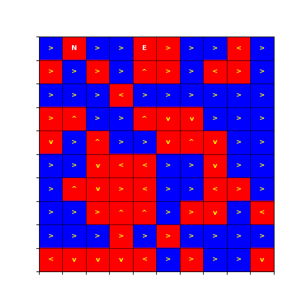

# Clean sea meritis project homework

[Clean sea link](https://cleansea.codeontime.fr/)

À la surface de l'océan flottent de nombreux déchets (et pas seulement le continent de plastique).  

Vous êtes en charge d'en nettoyer une région. Pour ce faire, vous allez commencer par installer des bases navales aux positions qui vous sembleront les plus pertinentes.  

Initialement, un bateau apparait sur chaque base navale. Chaque bateau va alors récupérer des déchets (tant qu'il n'a pas atteint sa limite de deux déchets en stock), les déposer dans une base navale (pas forcément celle dont il est issu), et ainsi de suite, pendant mille jours !  

Mais les bateaux sont très rudimentaires : il faut leur indiquer — pour chaque position possible — dans quelle direction se déplacer, ces instructions étant communes aux différents bateaux.  

Petite particularité : chaque bateau a une direction favorite, et part dans cette direction quand il est sur une base navale ou à la même position qu'un autre bateau.   

En pratique, la région est représentée par une carte M×N (2 ≤ M, N ≤ 300), c'est-à-dire par une grille M×N dont chaque case est encodée par les caractères X ou . :

- le caractère X indique une zone sur laquelle se trouve un déchet,
- la lettre . indique une zone sans déchet.  

Pour configurer vos bateaux, il vous suffit de fournir une carte, c'est-à-dire une grille M×N dont chaque case est encodée par les caractères N, O, S, E, ^, <, v ou > :

- les caractères N, O, S et E indiquent une base navale dont le navire a pour direction favorite respectivement le nord, l'ouest, le sud et l'est,
- les caractères ^, <, v et > indiquent que les navires à cette position vont se déplacer respectivement vers le nord, l'ouest, le sud et l'est.  

Chaque jour, chaque bateau va :

1. Ramasser les déchets sur sa position, s'il ne transporte pas déjà deux déchets et s'il est seul sur sa position,
2. Se débarrasser des déchets qu'il transporte s'il se trouve sur une base navale,
3. S'il est sur une base navale ou à la même position qu'un autre navire, partir dans sa direction favorite, sinon il part dans la direction correspondant à sa position.  
 

Évidemment, notre carte représente la planète Terre, et donc à l'ouest des positions les plus à l'ouest se trouvent les positions les plus à l'est, et inversement. Curieusement la Terre a maintenant une géométrie torique : au nord des positions les plus au nord se trouvent donc les positions les plus au sud, et inversement.  

Votre score correspond au nombre de déchets ramassés au bout de 1 000 jours.  

### En entrée
 
Sur la première ligne, trois entiers M, N et K (2 ≤ M, N ≤ 300, 2 ≤ K ≤ 50), où M et N représentent les dimensions de notre carte, et K le nombre de bateaux.

Sur les M lignes suivantes, N caractères (chacun étant un . ou X).  

Format de la sortie

M lignes, chacune composée de N caractères (N, O, S, E, ^, <, v ou >), avec au plus K caractères correspondant à des bases navales.

Exemple
```
10 10 2
....X...X.
.XX....X..
X.XX.XX.XX
X.XX.XX..X
..X..X...X
X...X.XX..
XXX.X.....
.X.XX.XX..
XXXX.XX.XX
..X.XX.X.X
```

Ici il y a une région de 10x10 et il est possible de placer jusqu'à 2bases.  

La carte correspond à celle du jeu en mode classique

Soumission de la réponse
Il y a 9 jeux de données, identifié par un nombre et un nom.

Pour valider chaque jeu de données, utiliser le bouton valider correspondant à son numéro.

Le score est la somme de tous les meilleurs scores sur chaque jeu de données.

# Output

Example of output result :

